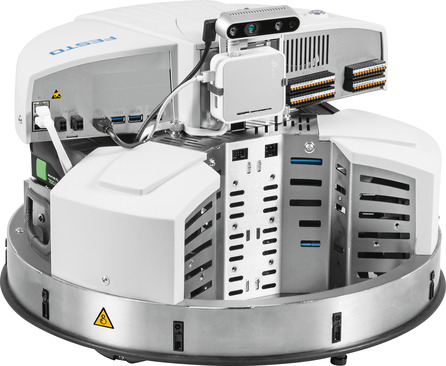
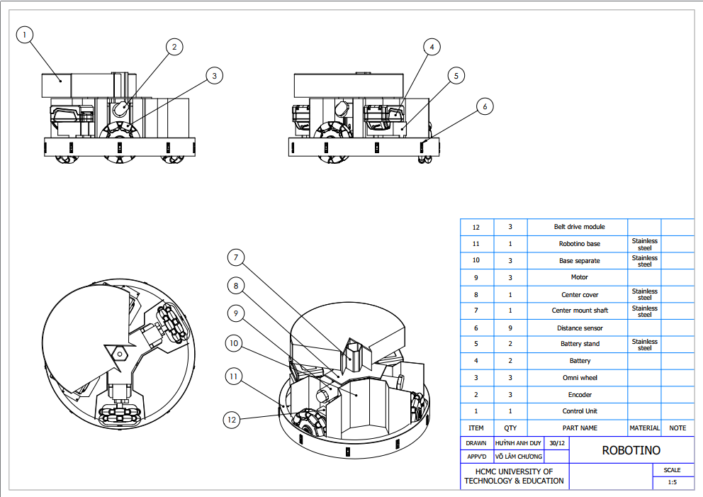
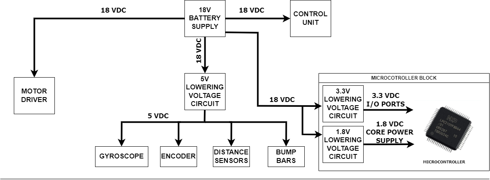
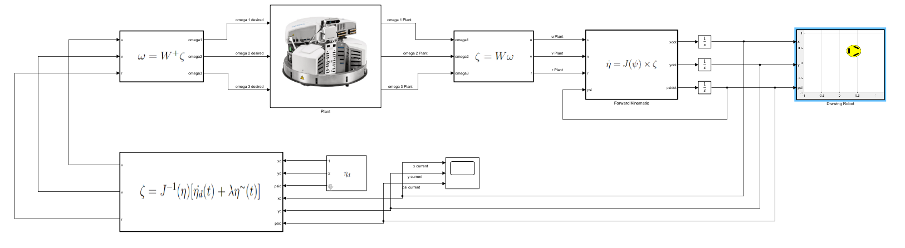
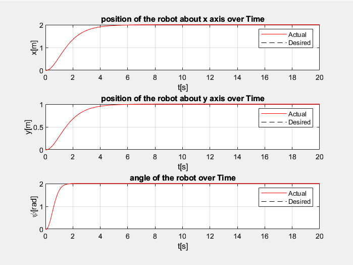
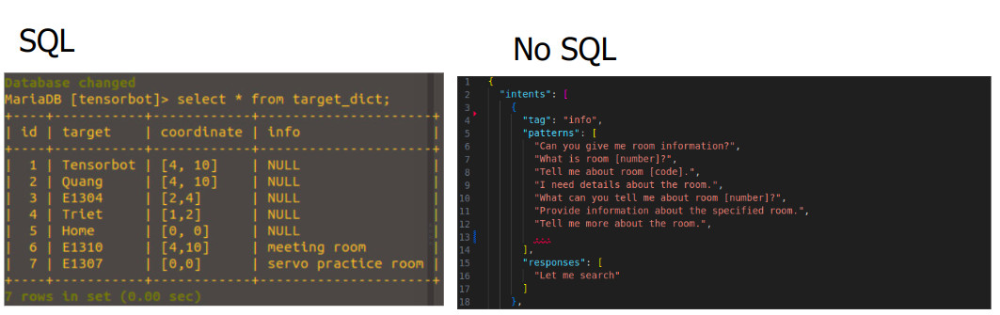
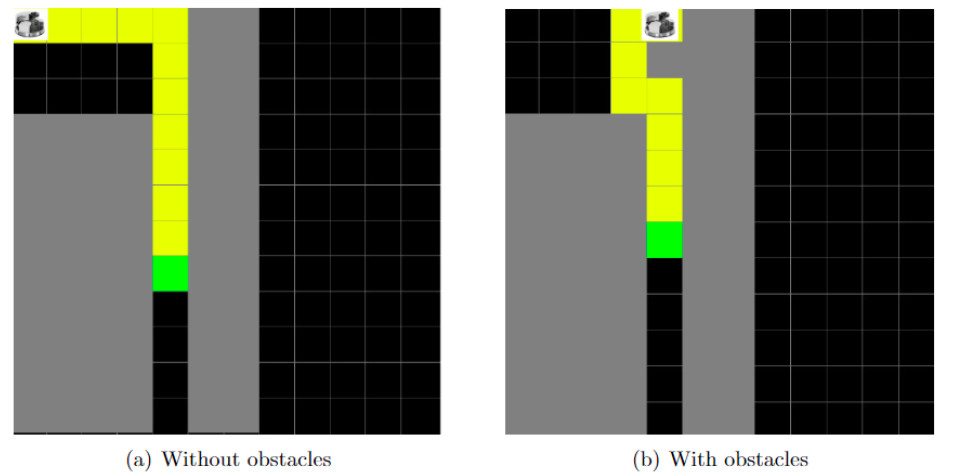
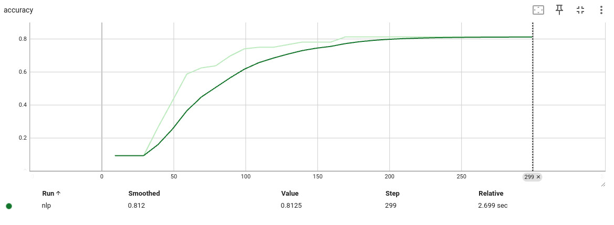
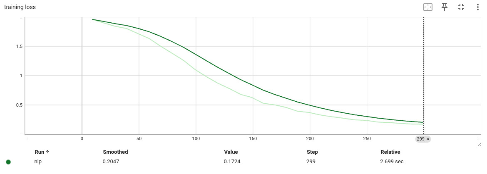
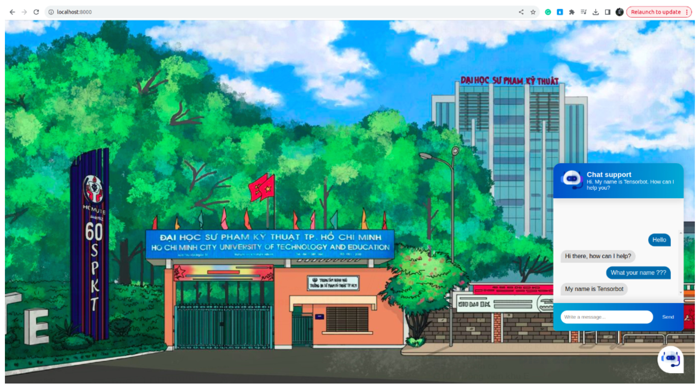

# TensorBot
[](https://skillicons.dev)




```bibtex
title = {Development Of a Mobile Service Robot}
advisor = {M.Sc. Vo Lam Chuong},
students = {Nguyen Ngoc Nhan, Nguyen Hai Hoang, Huynh Anh Duy}
year = {2023}
```
## To do task
- [x] Mechanical Design
- [x] Electrical and Electronic System
- [x] Model and Control Algorithm Design of The System
- [x] Design of Intelligent Algorithm
- [x] User Interface designing

## [MECHATRONICS PROJECT REPORT](./docs/report.pdf)
## Software
- [Download here](https://drive.google.com/drive/folders/1QeQVKOQrqvYlFl_fmG-g97QUFa41ZTPt?usp=sharing)


## Mechanical Design [More details in our report](./docs/report.pdf)




## Electrical and Electronic System [More details in our report](./docs/report.pdf)




## Model and Control Algorithm Design of The System [More details in our report](./docs/report.pdf)






## Design of Intelligent Algorithm [More details in our report](./docs/report.pdf)

### Database


### A-Star



### Training Result





## User Interface designing




## References
- https://youtube.com/playlist?list=PLpC3GniHRC0NSpHS_Y8AzRGS1mAb4zcHJ&si=G4dGPev_PCGBowcw

- https://www.youtube.com/@CraigMaynard7/videos
- https://doc.openrobotino.org/RobotinoFactory/help/en/
- https://archive.nptel.ac.in/courses/112/106/112106298/
- 

## Licence
    MIT License

    Copyright (c) 2023 Nguyễn Ngọc Nhân

    Permission is hereby granted, free of charge, to any person obtaining a copy
    of this software and associated documentation files (the "Software"), to deal
    in the Software without restriction, including without limitation the rights
    to use, copy, modify, merge, publish, distribute, sublicense, and/or sell
    copies of the Software, and to permit persons to whom the Software is
    furnished to do so, subject to the following conditions:

    The above copyright notice and this permission notice shall be included in all
    copies or substantial portions of the Software.

    THE SOFTWARE IS PROVIDED "AS IS", WITHOUT WARRANTY OF ANY KIND, EXPRESS OR
    IMPLIED, INCLUDING BUT NOT LIMITED TO THE WARRANTIES OF MERCHANTABILITY,
    FITNESS FOR A PARTICULAR PURPOSE AND NONINFRINGEMENT. IN NO EVENT SHALL THE
    AUTHORS OR COPYRIGHT HOLDERS BE LIABLE FOR ANY CLAIM, DAMAGES OR OTHER
    LIABILITY, WHETHER IN AN ACTION OF CONTRACT, TORT OR OTHERWISE, ARISING FROM,
    OUT OF OR IN CONNECTION WITH THE SOFTWARE OR THE USE OR OTHER DEALINGS IN THE
    SOFTWARE.
